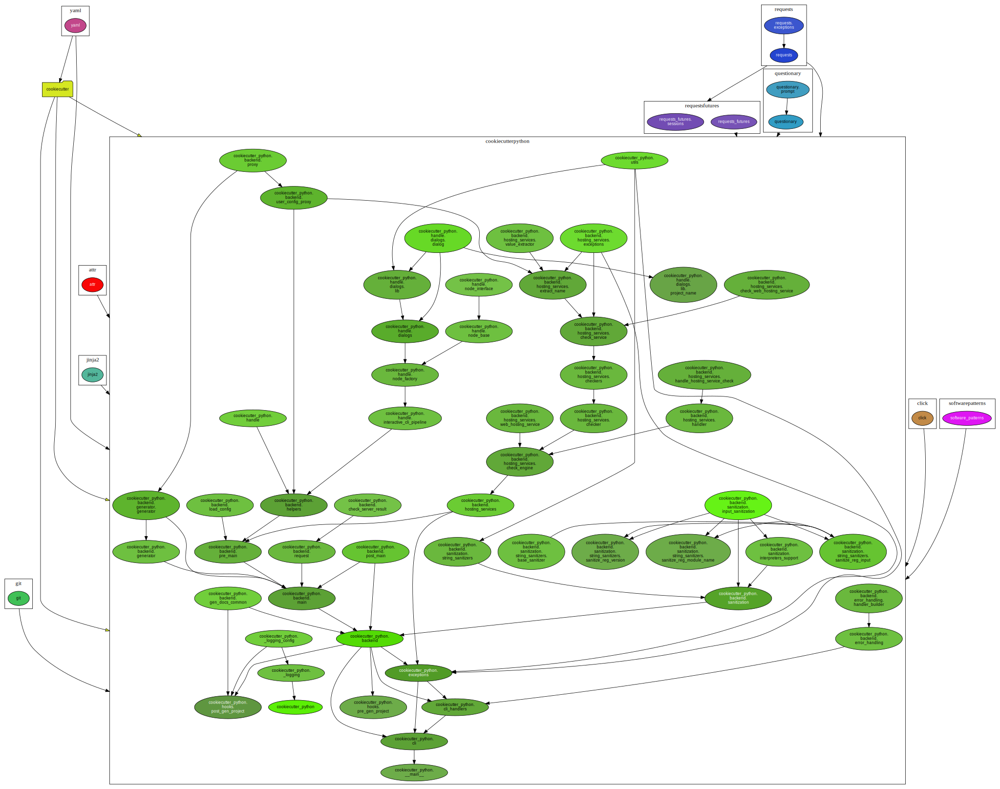

=====================
Software Architecture
=====================

.. Description of what is this Page
Here you can find the software architecture of the project.

Module Dependencies
===================

.. Description of what is this Section
Here you can find the dependencies between the modules of the project.

The dependencies are Visualized as a Graph, where Nodes are the modules and the Edges 
are python ``import`` statements.

The dependencies are visualized, after running the following command:

.. code-block:: bash

    tox -e pydeps

First-party Dependencies
------------------------

.. Inner Python Imports SVG Graph

All Dependencies - A
--------------------

.. "Boxed" [First-Party] with 3rd-party having 1 incoming edge to our Box

All Dependencies - B
--------------------

.. "Boxed" [First-Party] with 3rd-party having all incoming edges to our Box

All Dependencies - C
--------------------

.. First-Party with 3rd-party having all incoming edges to our individual Modules

