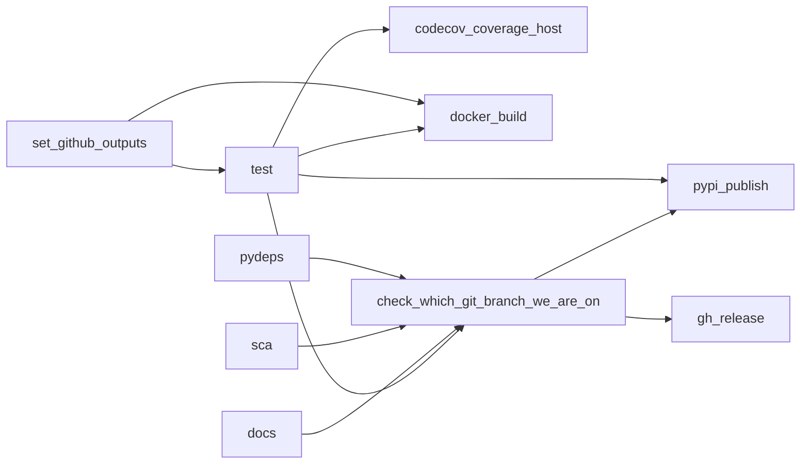

```mermaid
graph LR;
  set_github_outputs
  set_github_outputs --> test
  test --> codecov_coverage_host
  sca
  docs
  pydeps
  test --> docker_build
  set_github_outputs --> docker_build
  test --> check_which_git_branch_we_are_on
  docs --> check_which_git_branch_we_are_on
  sca --> check_which_git_branch_we_are_on
  pydeps --> check_which_git_branch_we_are_on
  check_which_git_branch_we_are_on --> pypi_publish
  test --> pypi_publish
  check_which_git_branch_we_are_on --> gh_release
```
