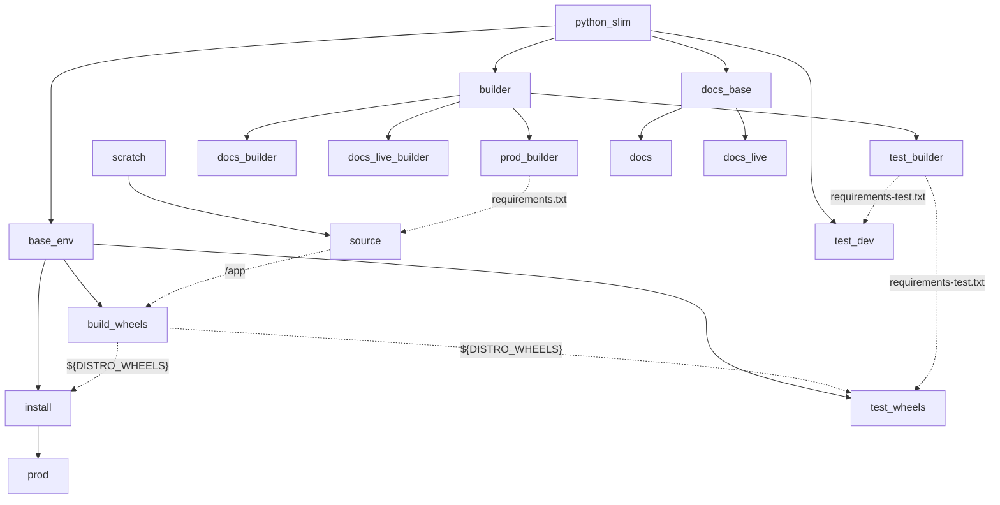

## Dockerfile Flow Chart

**Dockerfile: Dockerfile**

```mermaid
graph TB;
  python_slim --> builder
  builder --> prod_builder
  builder --> test_builder
  builder --> docs_builder
  builder --> docs_live_builder
  scratch --> source
  prod_builder -. "requirements.txt" .-> source
  python_slim --> base_env
  base_env --> build_wheels
  source -. "/app" .-> build_wheels
  base_env --> install
  build_wheels -. "${DISTRO_WHEELS}" .-> install
  python_slim --> test_dev
  test_builder -. "requirements-test.txt" .-> test_dev
  base_env --> test_wheels
  build_wheels -. "${DISTRO_WHEELS}" .-> test_wheels
  test_builder -. "requirements-test.txt" .-> test_wheels
  python_slim --> docs_base
  docs_base --> docs
  docs_base --> docs_live
  install --> prod
```
