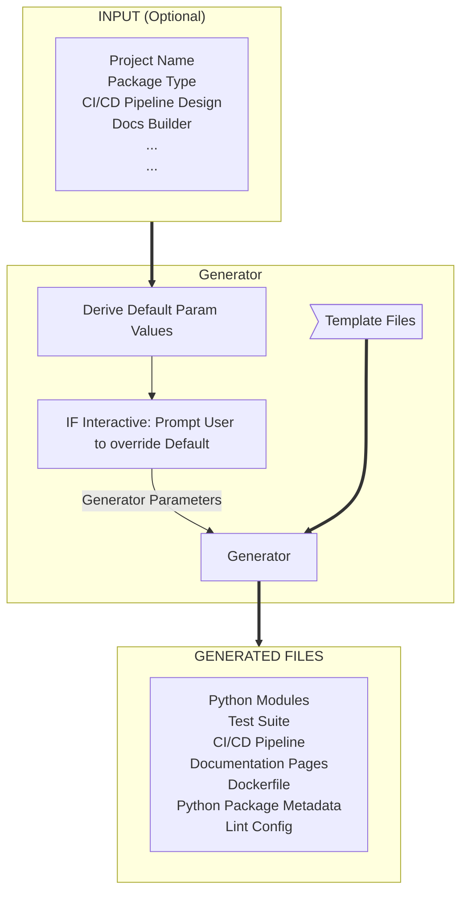

# Welcome to `Cookiecutter Python Package` Documentation!

**Cookiecutter Python Package**, is an open source project [github.com/boromir674/cookiecutter-python-package](https://github.com/boromir674/cookiecutter-python-package), that **Generates** `Open Source Python Projects`!

## A few words

**Goal** of `Cookiecutter Python Package` project is to automate the process of creating the necessary source files to set up and configure the **SDLF** of a new **Python Package**.

**SDLF** --> `Code`, `Tests`, `CI/CD`, `Docs`, `Docker`, `Config Files`

## **`Generator`** process 

Below is a high-level flowchart of the **`Generator`** process (see [Quick-start](#quick-start) below on how to run):



*Why choose this Python Package Generator?*
:material-information-outline:{ title="Important information" }

<div class="annotate" markdown>

> You get a **ready-to-develop** `Project`, configured to cover the whole **SDLF** (1):

</div>

1.  :man_raising_hand: Software Development Lifecycle

- Structured as Python Package, according to python standards
- Fully-featured CI/CD Pipeline
- Continuous Documentation build for Website
- Modern-standards toolkit
- Stress-tested across multiple platforms and python versions

Read the [Why to use this package](./topics/why_this_package.md) for more motivation 

## :material-bike-fast: Quick-start

**CLI `--help`**

=== "pipx"

    ```shell
    pipx run cookiecutter-python --help
    ```

=== "Docker"

    ```shell
    docker run -it --rm boromir674/generate-python:master --help
    ```


**Generate Project via interactive CLI**

=== "pipx"

    ```shell
    pipx run cookiecutter-python
    ```

=== "Docker"

    ```shell
    docker run -it --rm boromir674/generate-python:master
    ```

## :material-book-open: Documentation

Read about how to use the `cookiecutter-python` package, understand its features
and capabilities.

<div class="grid cards" markdown>


-   :fontawesome-regular-circle-play:{ .lg .middle } __`How-to` Guides__

    ---
    
    `How-to` **Step-by-step Guides**

    [:octicons-arrow-right-24: :material-rocket-launch: `Install`, `Run`, `Use`](./guides/index.md)


-   :material-application-brackets-outline:{ .lg .middle } __API References__

    ---
    [//]: # (link ./reference/CLI.md does not exist yet, it is generate at docs build-time)
    [:octicons-arrow-right-24: :material-console:{ .lg .middle } generate-python CLI](./reference/CLI.md)

    [//]: # (link ./reference/cookiecutter_python.md does not exist yet, it is generate at docs build-time)
    [:octicons-arrow-right-24: :material-language-python: API Refs](./reference/cookiecutter_python)


-   :fontawesome-solid-book-open:{ .lg .middle } __Topics__

    ---

    **Explanations / Topics**

    [:octicons-arrow-right-24: :material-language-python: Architecture ](./topics/arch.md)

    [:octicons-arrow-right-24: :material-generator-portable: Generator Process ](./topics/cli_logic.md)


-   :fontawesome-solid-book-open:{ .lg .middle } __Development Topics__

    ---

    **Topics / Explanations** on Development

    [:octicons-arrow-right-24: :material-hammer-screwdriver: Development Topics ](./topics/development/index.md)


</div>
