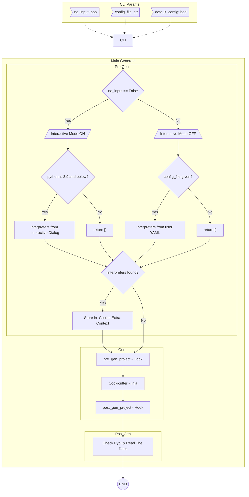

```mermaid
graph TB
    subgraph cli ["CLI Params"]
    ni>"no_input: bool"]
    cf>"config_file: str"]
    dc>"default_config: bool"]
    end

    ni .-> A
    cf .-> A
    dc .-> A

    A["CLI"] --> if1

    subgraph gen ["Main Generate"]


        subgraph pre_gen_s ["Pre Gen"]
            if1{"no_input == False"} -- Yes --> y1[/"Interactive Mode ON"/]
            if1 -- No --> n1[/"Interactive Mode OFF"\]

            y1 --> if2{"python is 3.9 and below?"}
            if2 -- Yes --> y2["Interpreters from Interactive Dialog"]
            if2 -- No --> n2["return []"]
            
            n1 --> if3
    
            if3{"config_file given?"} -- Yes --> y3["Interpreters from user YAML"]
            if3 -- No --> n3["return []"]
            
            y2 --> if4
            n2 --> if4
    
            y3 --> if4
            n3 --> if4
    
            if4{"interpreters found?"} -- Yes --> y4["Store in  Cookie Extra Context"]
    
        end

        y4 --> g1
        if4 -- No --> g1
    
        subgraph gen_s ["Gen"]
            g1["pre_gen_project - Hook"] --> g
            g["Cookicutter - jinja"] --> g2
            g2["post_gen_project - Hook"]
        end
    
        g2 --> p1

        subgraph post_gen_s ["Post Gen"]
            p1["Check PypI & Read The Docs"]
        end

    end

    %% this is a mermaid comment

    p1 --> E
    E(("END"))
```
