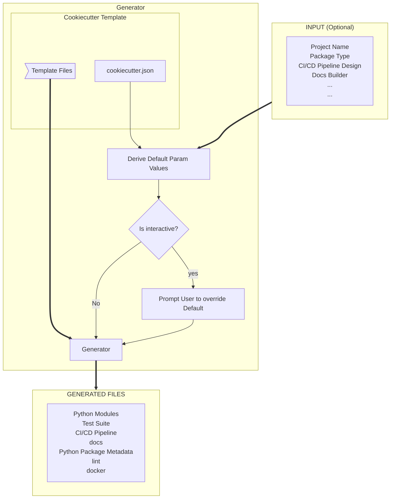
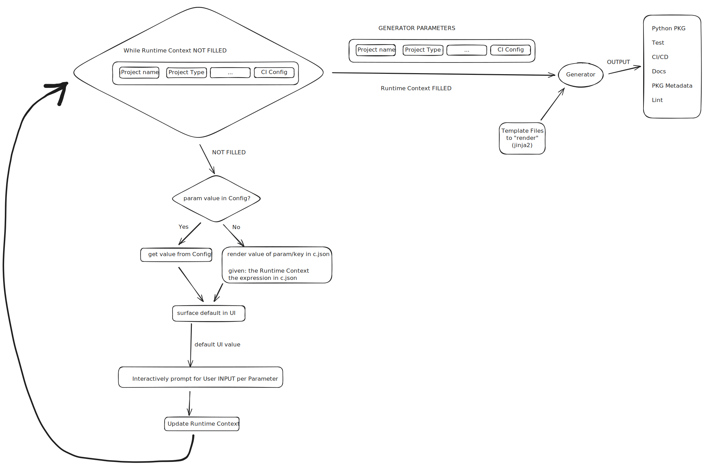

# Parametrized Generator Process

> Understand the **Generation Process**, in depth 

```mermaid
graph

    %% INPUTS to Generator
    subgraph inputs ["INPUT (Optional)"]
        input_things["Project Name
        Package Type
        CI/CD Pipeline Design
        Docs Builder
        ...
        ...
        "]

    end
    
    inputs ==> derive_default

    %% APPLICATION LAYER
    subgraph gen ["Generator"]

        %% INPUTS to Generator

        derive_default["Derive Default Param Values"]    

        is_interactive{"Is interactive?"}

        prompt["Prompt User to override Default"]

        Gen["Generator"]

        subgraph coo ["Cookiecutter Template"]
            template>"Template Files"]
            cjson["cookiecutter.json"]
        
        end
        
        cjson --> derive_default
        derive_default --> is_interactive
        is_interactive -- "No" --> Gen
        is_interactive --"yes"--> prompt
        prompt --> Gen
        template ==> Gen

    end    
    
    Gen ==> out

    %% OUTPUTS of Generator
    subgraph out ["GENERATED FILES"]
        py["Python Modules
        Test Suite
        CI/CD Pipeline
        docs
        Python Package Metadata
        lint
        docker
        "]

    end
```

---

!!! Tip
    Right-click -> open image in new tab

