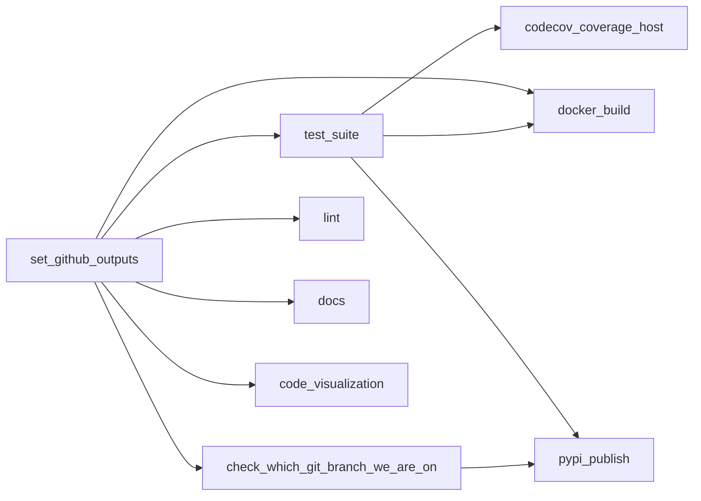

```mermaid
graph LR;
  set_github_outputs --> test_suite
  test_suite --> codecov_coverage_host
  set_github_outputs --> docker_build
  test_suite --> docker_build
  set_github_outputs --> check_which_git_branch_we_are_on
  test_suite --> pypi_publish
  check_which_git_branch_we_are_on --> pypi_publish
  set_github_outputs --> lint
  set_github_outputs --> docs
  set_github_outputs --> code_visualization
```
