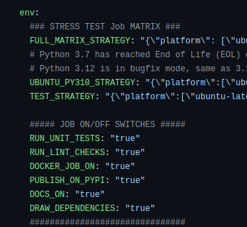

# How-To Guides for Development

This section includes practical, *how-to* guides, for a **developer** to achieve something.  
Guides on how to **run tests** against your code, how to **publish to PyPI**, how to build
a Docker Image and **publish it to Dockerhub**, how to do `Static Code Analysis`, etc.


## How to prevent any Image from being published to Dockerhub

1. Open your `.github/workflows/test.yaml`, and look for the **Worfklow Variables**
 
    **Worfklow Variables** are defined in the `env` *section*

2. Check the *value* of the `DOCKER_JOB_ON` **Worfklow Variable**
    
    [this is line is not rendered; markdown comment]: #

    

3. If *value* is **false**, then we are OK.
   
4. If not, set value* to **false**

    ```shell
    git add .github/workflows/test.yaml
    git commit "ci: emphemerally prevent any Image Build and Dockerhub Publish"
    ```

Now, it is **guaranteed**, that **NO** Dockerhub Publish will happen,
by any Pipeline subsequent `trigger`, aka `git events` (ie `git push`) fired.

**Info**: the `DOCKER_JOB_ON` is a top-level Gate to all Docker-related in CI.
Only, if `DOCKER_JOB_ON` is **true**, any image build and publish can be ever considered.

### References

- https://automated-workflows.readthedocs.io/en/main/guide_setup_cicd/
- https://automated-workflows.readthedocs.io/en/main/ref_docker/
