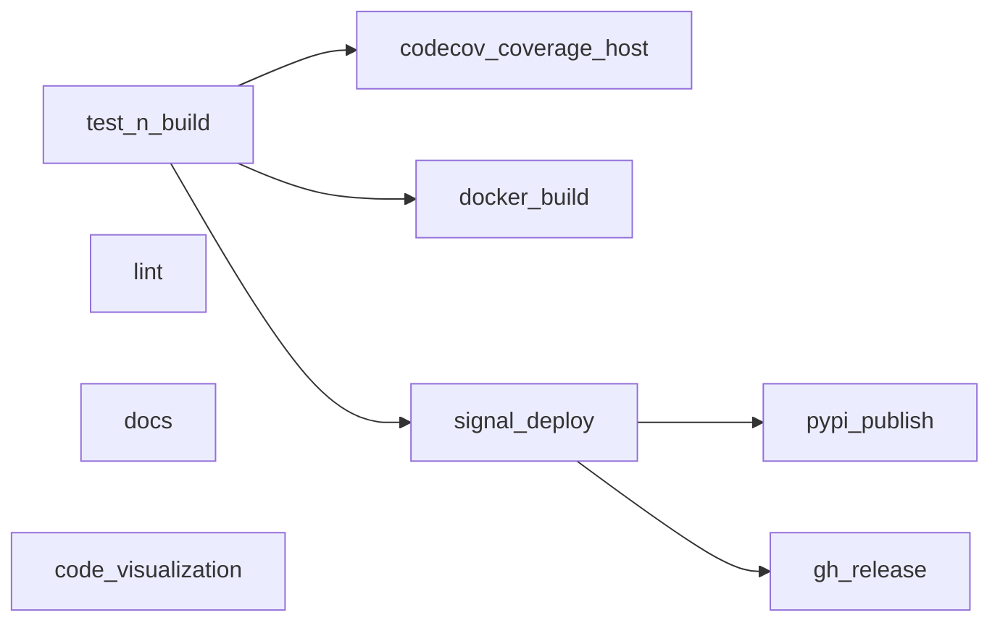

```mermaid
graph LR;
  test_n_build
  test_n_build --> codecov_coverage_host
  test_n_build --> docker_build
  lint
  docs
  code_visualization
  test_n_build --> signal_deploy
  signal_deploy --> pypi_publish
  signal_deploy --> gh_release
```
